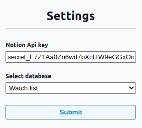
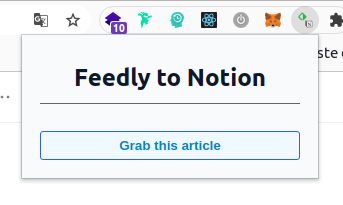
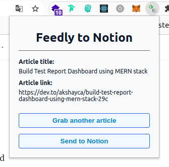

# Feedly to notion chrome extension
This extension allow you to populate your notion database with article from Feedly web app.

## Requirements
* A feedly account with some articles to grab
* A notion account with an API key that allowed write access to the desired database
* An up-to-date chrome browser

## Getting started
### 1) Install the extension
Download this repository and install it to your chrome browser. If you don't know how to install a chrome extension, you can use the following steps :

1. Open your web browser and go to [chrome://extensions/](chrome://extensions/)
2. Enable the developer mode on the right top corner
3. Click on the "Load unpackaged extension" button and load the root folder from this repository

### 2) Configure the extension
Access to the option panel by right-clicking on the extension icon. Be sure to enable the extension in order to access it from the chrome toolbar.

#### 2.1) Get your notion API key
In order to configure the extension, you need to get an notion API key. If you don't know how to get it, you can follow [these steps](https://developers.notion.com/docs/getting-started#step-1-create-an-integration) from the notion documentation.

#### 2.2) Add the API key to the option form
Add your API key and click on the submit button, a list of linked databases should appear. If your api key is not valid then you will get an error message.

#### 2.3) Select your database
Select the one you wish to use then click on the submit button. Your database require two field "name" and "URL", be sure to have these one configured before going further.

### 3) Use the extension on Feedly
When the extension is correctly configured you can go to feedly and open an article. Click on the extension icon and press the "Grab this article" button.

The recovered information is shown to you before being sent to notion. If the article informations are correct, then click on the "Send to Notion" button to add it to your database.

# Roadmap

this extension is designed to keep track of interesting articles

- [x] Get title and url of the current article
- [x] Use the notion API to send an article to a database
- [x] Possibility to change a database
- [] Add tags
- [] Add a WYSWYG field to make a summary 
